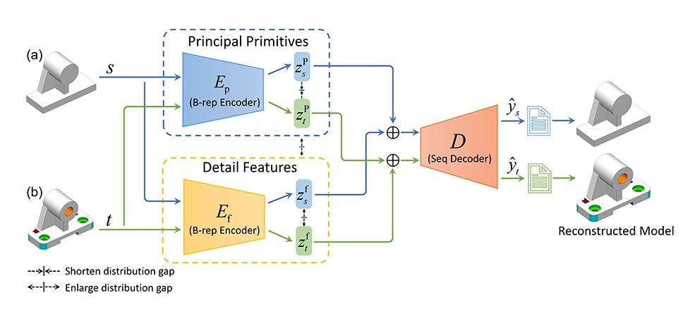

# Brep2Seq

This code for the paper: Brep2Seq: A Dataset and Hierarchical Deep Learning Network for Reconstruction and Generation of Computer-Aided Design Models



## About Brep2Seq

Brep2Seq, a deep neural network that directly takes the B-rep data of 3D CAD models as input, inspired by the Transformer network (Vaswani et al., 2017, ) and its adaptation to graph-structured data, known as Graphformer (Ying et al., 2021). This network can encode the B-rep data into a latent space and decode a sequence of CAD feature modeling operations. The sequence comprises two types of modeling operations: one for assembling basic geometric primitives (e.g., cuboid, prism, cylinder, cone, and sphere) to form the primary shape of the CAD model, and another for common mechanical features (e.g., hole, groove, fillet, and chamfer). 

## Preparation

### Environment setup

```
git clone https://github.com/zhangshuming0668/Brep2Seq.git
cd Brep2Seq
conda env create -f environment.yml
conda activate brepnet
```

### Data preparation

You can download the synthetic CAD models dataset from [this link](https://github.com/zhangshuming0668/Brep2Seq/tree/main/dataset).

## Training

To reconstruct B-rep models, the network can be trained using:
```
python reconstruction.py train --dataset_path /path/to/dataset --batch_size 64
```

The logs and checkpoints will be stored in a folder called `results/BrepToSeq` based on the experiment name and timestamp, and can be monitored with Tensorboard:

```
tensorboard --logdir results/<experiment_name>
```

## Testing

The best checkpoints based on the smallest validation loss are saved in the results folder. The checkpoints can be used to test the model as follows:

```
python reconstruction.py test --dataset_path /path/to/dataset --checkpoint ./results/BrepToSeq/best.ckpt --batch_size 64
```

The predicted reconstruction sequences files are saved in the results folder `results/predicted_seq`.

## Generation

For random generation, further train a latent GAN:

```
python generation.py train --dataset_path /path/to/dataset --pretrained ./results/best.ckpt --batch_size 64 
```

After training the latent GAN, run latent GAN to do random generation:

```
python generation.py generate --checkpoint ./results/best_gan.ckpt --n_samples 256 --batch_size 64 
```
The generated construction sequences files are saved in the results folder `results/generated_seq`.
